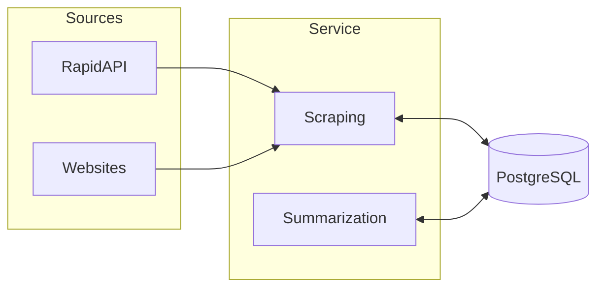
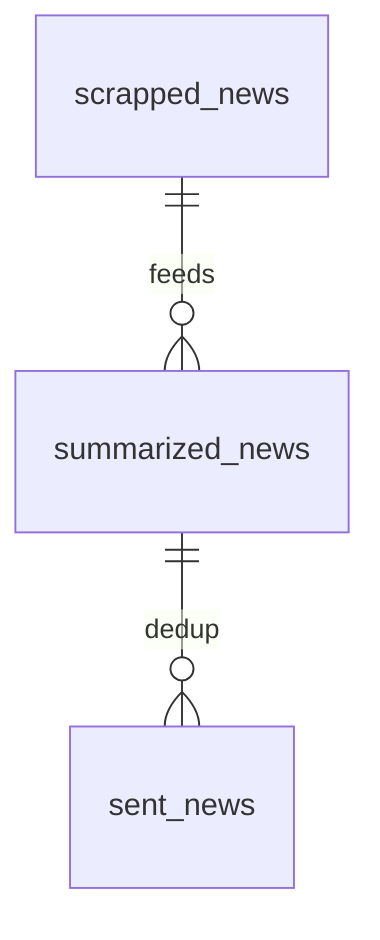

# README & Wiki documentation

Maintain two distinct documentation surfaces and keep them in sync with the code. Use
**Mermaid** for all schemas and flows (never ASCII art, never screenshots of diagrams).

> 🚫 **Hard rule, no exceptions: never put `<br/>` in a Mermaid node label, and keep every label
> under ~25 characters.** Longer or multi-line labels render *outside* their box on real wikis.
> Detail goes in a table under the diagram. Full explanation:
> [Mermaid for every diagram](#mermaid-for-every-diagram).

## When this fires — non-negotiable

Documentation is part of "done". A functional code change is **not complete** until the docs
that describe it are updated **in the same change** (same branch, ideally a dedicated `docs:`
commit). Do not wait to be asked, and do not defer it to "later".

**Before you commit or push**, run this self-check whenever the diff touches any of:

- [ ] `src/` — behaviour, a new/changed job, a public function contract, a pipeline step
- [ ] `config/settings.py`, `.env.example`, or any new/renamed env var or default
- [ ] `pyproject.toml` / lockfile — a dependency added, removed, or swapped
- [ ] the database schema (tables, columns, relationships)
- [ ] `pipelines/` / CI-CD / deployment
- [ ] any flow, architecture, or schema that an existing Mermaid diagram depicts
- [ ] any Mermaid diagram you wrote or edited — `grep -rn 'br/>' README.md docs/` **must return
      nothing**, and every node label must be a short single-line phrase

If **any** box applies, invoke this skill and update the matching surface **before** the change
is considered finished. If you already committed the code without the docs, follow up immediately
with the docs commit on the same branch — never leave the branch in a code-without-docs state.

A quick grep is the cheapest guard against stale docs: search `README.md` and `docs/` for the
symbol/dependency/setting you just changed (e.g. `grep -rni "goose\|OLD_SETTING" README.md docs/`)
and fix **every** hit, not just the obvious page.

## The README / Wiki split — never blur these

| | **README** | **Wiki** |
|---|---|---|
| Location | `README.md` at repo root | `docs/` folder, synced to the project wiki by CI |
| Audience | Anyone landing on the repo | People working *on* the project |
| Content | What/why, prerequisites, install, run, repo structure, code standards | Architecture, workflows, jobs, DB schema, configuration, deployment, local dev, troubleshooting/runbooks |
| Length | Short entry point | Extended, multi-page, navigable |
| Lifecycle | Versioned with the code, evolves with each PR | Own history; published by the CI wiki-sync stage from `docs/` |

**Rule of thumb:** README is the short, versioned entry point. The Wiki is the extended,
living documentation. Put deep technical detail in the Wiki and link to it from the README —
do **not** duplicate architecture/DB/deployment detail in the README.

The README should carry a pointer near the top. Use the link that matches the platform:

```markdown
> 📖 **Full technical documentation: see the [project wiki](../../-/wikis/home).**   <!-- GitLab -->
> 📖 **Full technical documentation: see the [project wiki](../../_wiki).**           <!-- Azure DevOps -->
> This README only covers the overview and installation. Architecture, jobs, database schema,
> deployment and troubleshooting live in the wiki (the [`docs/`](docs/) folder).
```

## Detect the platform first

The wiki-sync mechanism and the navigation conventions differ by platform. Detect it before editing:

- **GitLab** — repo has `.gitlab-ci.yml` (or a `gitlab.*` remote).
  Wiki nav = `_sidebar.md`.
- **Azure DevOps** — repo has `azure-pipelines*.yml` / `.azure-pipelines/` (or a `dev.azure.com` /
  `visualstudio.com` remote). Wiki nav = `.order`.

Both publish the same `docs/` folder to a **separate wiki repository** through a CI stage; only
the wiki repo URL and the navigation file differ.

## Wiki folder conventions

Common to both platforms:
- One `.md` file per page, kebab-case filename (`local-development.md`).
- `home.md` is the landing page.
- Keep the navigation file in sync with the actual page set on every change.

Typical page set (adapt to the project):

```
home            architecture    workflow        jobs
database        configuration   deployment      local-development
troubleshooting
```

### GitLab wiki

- `docs/` is rsynced to `<project>.wiki.git` by the wiki-sync job in `.gitlab-ci.yml` (runs on
  the default branch only; see the `cicd` skill, `reference/ci/gitlab.md`). Auth via the
  `CI_WIKI_TOKEN` CI/CD variable — a **Project Access Token**, Developer role, `write_repository`
  scope (masked).
- Navigation = **`_sidebar.md`** at the wiki root: a markdown list of links, shown on every page.
  There is **no `.order`** in GitLab.
- Links = slug **relative**, no leading `/`, no `.md`: `[Architecture](architecture)`.
- `home.md` = landing content (title + summary); the sidebar carries the navigation.

Example `_sidebar.md`:

```markdown
# [Home](home)

- [Architecture](architecture)
- [Workflow](workflow)
- [Configuration](configuration)
- [Deployment](deployment)

[Edit sidebar](/_sidebar/edit)
```

### Azure DevOps wiki

- `docs/` is published to the Azure DevOps wiki by the wiki-sync stage (see the `cicd` skill,
  `reference/ci/azure-devops.md`). Auth via the `WIKI_TOKEN` variable — a PAT with **Wiki (Read &
  Write)** scope.
- Navigation = **`.order`**: page slugs (no extension), one per line, in navigation order.
  **Every new page must be added to `.order`** or it won't be ordered in the wiki nav.
- Links = **root-relative** `/page-name`, no `.md`: `[Architecture](/architecture)`.
- `home.md` = landing page with a one-paragraph summary + a "Contents" table linking every page.

## Mermaid for every diagram

### The one mistake that keeps happening: labels overflowing their box

**Never use `<br/>` in a node label. Keep every label to a short single-line phrase (~25 chars).**

Mermaid computes each box's width by *measuring* the label text, then draws the box and renders the
text into it. When the page's font loads **after** that measurement — or the renderer measures with a
fallback font — the real glyphs come out wider than the computed box and the text spills outside it.
A single short label hides the error; a `<br/>`-split label visibly clips its longest line. Long
unbroken tokens (`npm install --legacy-peer-deps`, `AzureRmWebAppDeployment@4`) are the worst
offenders. Azure DevOps wiki, GitHub and VS Code preview all do this, so there is **no per-renderer
setting that fixes it** — the only reliable fix is authoring short labels.

```text
WRONG — the second line renders outside the box
    B["cd frontend<br/>npm install --legacy-peer-deps"]

RIGHT — short label, the detail lives in the table below
    B["npm install"]
```

Detail that does not fit goes in a **table directly under the diagram** (node → code path →
configuration). The diagram carries the shape; the table carries the specifics — and unlike text
crammed into a box, a table stays greppable and diff-friendly.

**Verify before committing** — this must print nothing:

```bash
grep -rn 'br/>' README.md docs/
```

To check actual rendered geometry (worth it for a diagram you will publish), serve the file and
measure each label against its shape — zero overflow expected:

```javascript
document.querySelectorAll('pre.mermaid svg .node').forEach(n => {
  const s = n.querySelector('rect, polygon, circle, path').getBoundingClientRect();
  const l = n.querySelector('.label, foreignObject, text').getBoundingClientRect();
  if (l.right > s.right + 1 || l.left < s.left - 1) console.warn('overflow:', n.textContent.trim());
});
```

### Diagram types

Use fenced ` ```mermaid ` blocks. Pick the right diagram type:

- **Architecture / components / data flow** → `flowchart LR` or `TD` with `subgraph` groupings.
- **Step-by-step pipeline / use-case walkthrough** → `flowchart TD` numbered steps.
- **Sequence of calls between services** → `sequenceDiagram`.
- **Database schema** → `erDiagram`.
- **State machines / lifecycles** → `stateDiagram-v2`.

Style rules:
- **No `<br/>`, labels under ~25 chars, detail in a companion table** — see above. Non-negotiable.
- Quote every label: `A["search + scraping"]` — allows spaces, slashes and punctuation.
- One label = one short noun phrase. No commands, no flags, no env-var lists inside a box.
- Databases as `DB[("PostgreSQL")]` — name the database in the companion table.
- Keep node ids short and uppercase; put readable text in the label.

Architecture example:



| Node | Code | Configuration |
|---|---|---|
| RapidAPI | `scraping/client.py` | `RAPIDAPI_KEY` |
| Scraping | `scraping/` | — |
| Summarization | `gpt/` | `OPENAI_API_KEY` |
| PostgreSQL | `db/models.py` | `DATABASE_URL` |

DB schema example:



## How to apply

When invoked, or after a code change that affects documented behaviour:

1. **Detect surfaces and platform.** Confirm the repo has `README.md` and a `docs/` folder, and
   whether CI is GitLab (`.gitlab-ci.yml`) or Azure DevOps (`azure-pipelines*.yml`). If `docs/`
   is missing but the project is non-trivial, propose creating it with `home.md` + the matching
   navigation file (`_sidebar.md` for GitLab, `.order` for Azure DevOps).
2. **Map the change to the right surface.** Overview/install/structure → README. Architecture,
   jobs, schema, config, deployment, runbooks → the relevant `docs/*.md` page.
3. **Update, don't duplicate.** Edit the affected page(s); keep the README a thin pointer. Keep
   the navigation file in sync with the actual page set: `_sidebar.md` (GitLab) or `.order`
   (Azure DevOps).
4. **Refresh diagrams.** If the change alters a flow/architecture/schema that a Mermaid diagram
   depicts, update that diagram in the same edit. Add a new Mermaid diagram when a new flow or
   component is introduced.
5. **Check every diagram you touched.** Run `grep -rn 'br/>' README.md docs/` — it must return
   nothing. Scan the labels you wrote: any longer than ~25 characters, or containing a command, a
   flag or an env-var list, moves to the table under the diagram. Do this *before* the link check —
   an overflowing label is the single most common defect in these docs.
6. **Verify links per platform.** GitLab: slug-relative `[Text](page-slug)`. Azure DevOps:
   root-relative `/page-name`. Neither uses `.md`. Every page referenced in the nav exists.
7. **Commit** the docs change following the `git-conventions` skill (`docs(scope): …`). The CI
   wiki-sync stage publishes `docs/` to the project wiki on the next run to the default branch.
